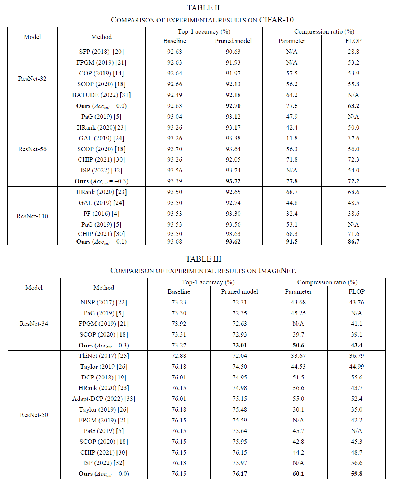

# Weight- and Gradient-Aware Automatic Structured Pruning for Deep Neural Networks
  
## Requirements

* Python 3.6
* Pytorch  >=1.6
* Torchvision >= 0.6.0+cu101
* Numpy >= 1.18.2
* tqdm  >= 4.62.0

## Quick start
1. Prepare the pre-trained model and the dataset for fine-tuning (CIFAR-10, ImageNet).  
Pre-trained models for example codes can be downloaded from the following links.
* https://zenodo.org/record/5900671#.Ye-tKOrP38A  (for CIFAR-10)   
* https://github.com/pytorch/vision/blob/main/torchvision/models/resnet.py  (for ImageNet)  

2. Move to sample code directory.  
```
cd /examples/<sample>
```

3. Set the file path of the dataset and pre-trained model in `run.sh`.  
Example of `/examples/resnet34_imagenet/run.sh`  
```
CUDA_VISIBLE_DEVICES='0' python3 main.py --data ../dataset/imagenet/ --pretrained_model_path ../pretrained_model/resnet34-b627a593.pth > log.log
```
* `--data` The file path for retraining dataset, e.g. CIFAR-10 and ImageNet.
* `--pretrained_model_path` The file path of pre-trained model.

4. Execute `run.sh`.  
```
chmod +x run.sh && ./run.sh
```

### Note: When running inference with pruned model by this code
The number of channels of pruned model is changed from the model before pruning.
So, when run the inference using the model pruned by this code, please change the number of channels of the pruned model defined in model file (e.g. `resnet34.py`).

## Results
<p align="center">

</p>
